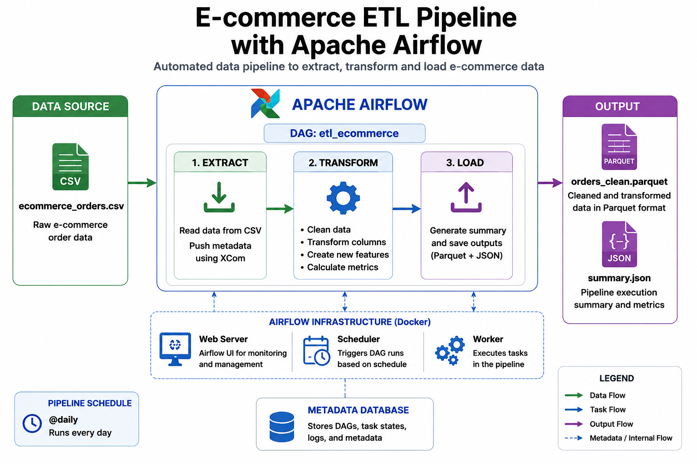
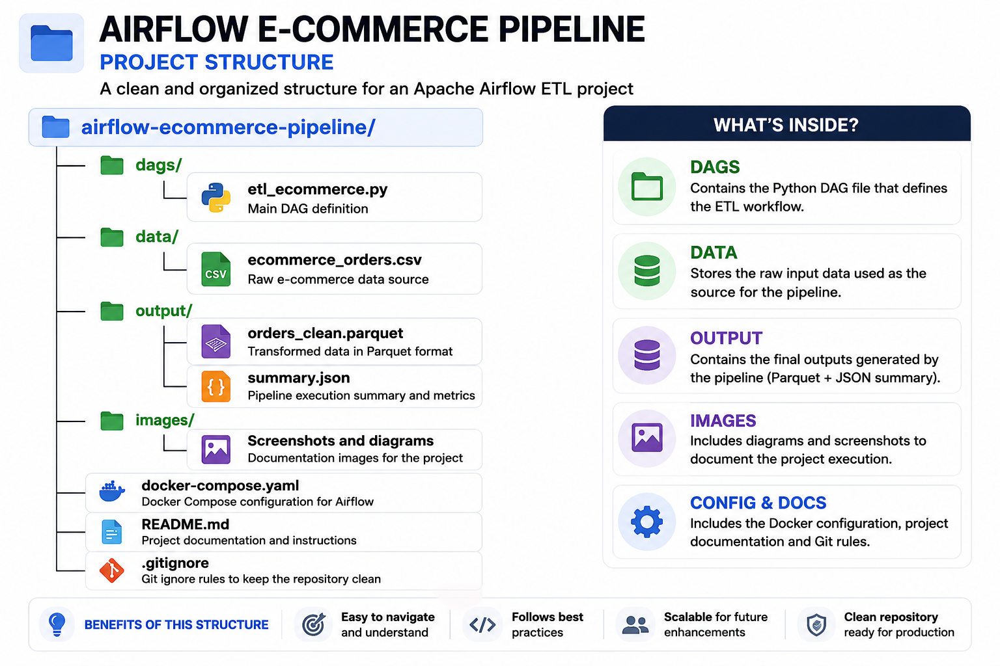

# E-commerce ETL Pipeline with Apache Airflow 🚀

## 📌 Project Overview

This project implements an automated ETL data pipeline using Apache Airflow.

The pipeline extracts raw e-commerce order data from a CSV file, processes and transforms the data using Python and Pandas, calculates business metrics, and generates analytics-ready outputs.

Apache Airflow is used as the workflow orchestration tool to schedule, monitor, and manage the complete data pipeline.

The entire environment runs inside Docker containers using Docker Compose.

---

# 🏗 Pipeline Architecture

The following diagram shows the complete ETL workflow orchestrated by Apache Airflow.



---

# 🛠 Technologies Used

- Apache Airflow
- Docker
- Docker Compose
- Python
- Pandas
- Parquet
- JSON
- Git & GitHub

---

# 📂 Project Structure

The project follows a clean and organized structure:



Main components:

- **dags/**  
Contains the Airflow DAG definition and pipeline logic.

- **data/**  
Stores the raw input dataset.

- **output/**  
Stores the processed files generated by the pipeline.

- **images/**  
Contains project documentation images.

- **docker-compose.yaml**  
Defines the Airflow environment and required services.

---

# 🔄 ETL Workflow

The Airflow DAG contains three main tasks:

## 1️⃣ Extract

The extraction task:

- Reads raw e-commerce data from a CSV file.
- Loads the dataset using Pandas.
- Shares information between tasks using Airflow XCom.

---

## 2️⃣ Transform

The transformation task:

- Cleans and processes the dataset.
- Converts date columns.
- Creates additional features.
- Calculates business metrics:

Metrics generated:

- Total number of orders
- Total revenue
- Average order value

The transformed data is stored using Parquet format.

---

## 3️⃣ Load

The load task:

- Generates a JSON summary file.
- Stores the final processed outputs.

Generated files:

- orders_clean.parquet
- summary.json

---

# 📊 Airflow DAG Execution

## DAG Workflow

The DAG follows this execution order:


---

# ⚙️ How to Run the Project

## 1. Clone the repository

```bash
git clone https://github.com/RicardoMartinez777/airflow-ecommerce-pipeline.git
```

---

## 2. Start Airflow using Docker Compose

```bash
docker compose up -d
```

---

## 3. Open Airflow UI

Open:

```text
http://localhost:8080
```

Login:

```text
Username: airflow
Password: airflow
```

---

# ⏰ Pipeline Scheduling

The DAG is configured to run daily:

```python
schedule_interval='@daily'
```

This means Airflow automatically triggers the pipeline once per day.

---

# 🔍 Monitoring and Debugging

Airflow provides:

- DAG execution status
- Task monitoring
- Execution history
- Task logs for debugging

Logs allow tracking each pipeline step and identifying possible failures.

Example:


---

# 📚 What I Learned

Through this project I practiced:

- Designing ETL workflows
- Creating Apache Airflow DAGs
- Managing task dependencies
- Using Airflow XCom
- Scheduling automated pipelines
- Working with Docker Compose
- Processing data with Pandas
- Saving analytics data using Parquet
- Monitoring and debugging workflows

---

# 👤 Author

Ricardo Martínez
